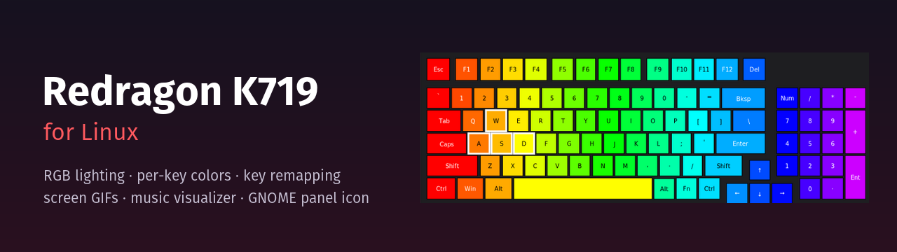
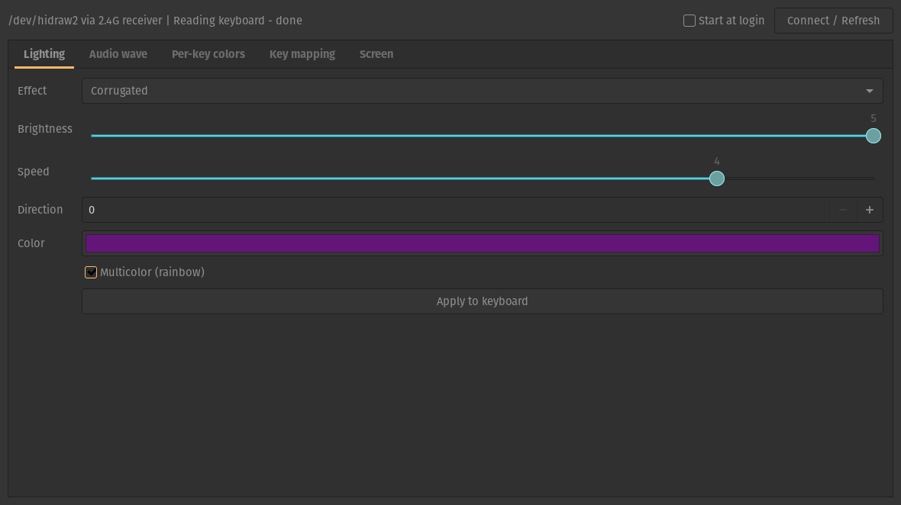
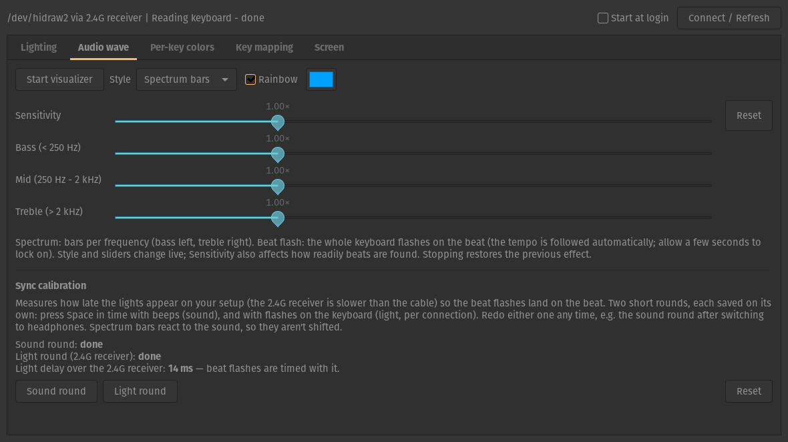
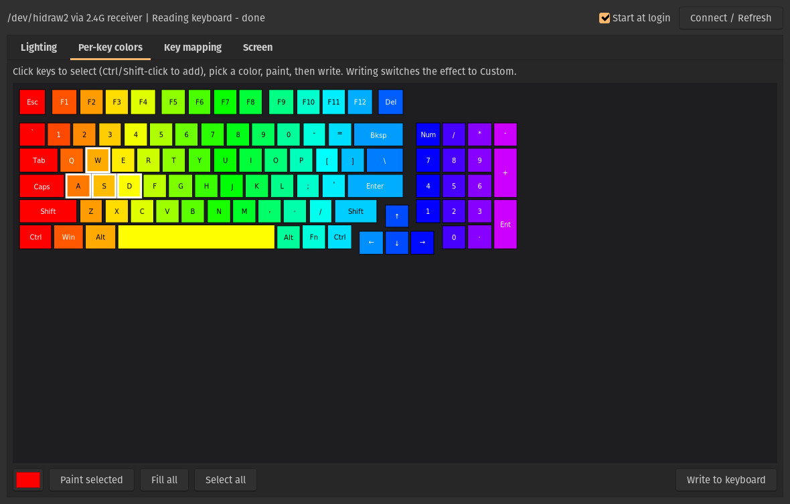
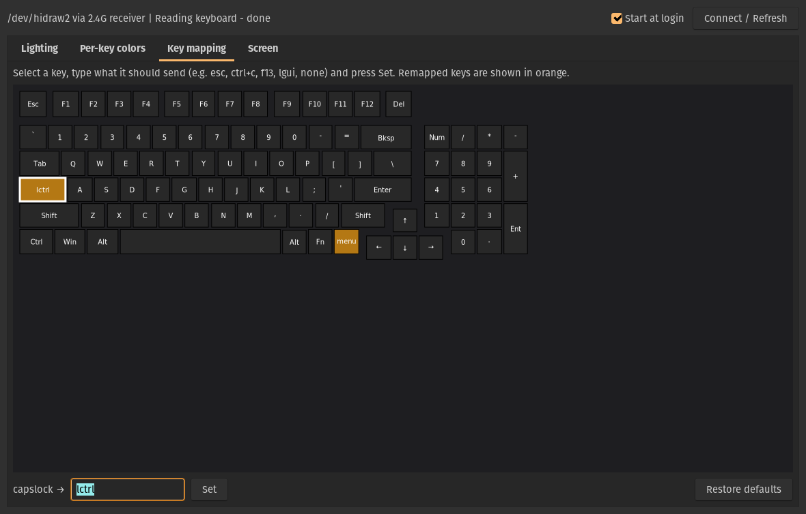
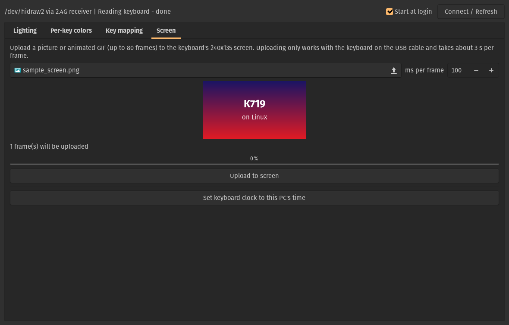
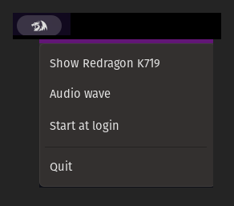

<p align="center">
  
</p>

<p align="center">
  <a href="LICENSE"></a>
  
  
  
  
</p>

<p align="center">
  <b>An unofficial Linux app for the Redragon K719 (Galatin Pro) keyboard.</b><br>
  Everything the Windows software does, plus a command-line tool, a GNOME panel icon and a
  better music visualizer. It works over the USB cable and the 2.4G receiver.
</p>

<p align="center">
  <a href="#-install">Install</a> ·
  <a href="#-screenshots">Screenshots</a> ·
  <a href="#-getting-started">Getting started</a> ·
  <a href="docs/CLI.md">CLI reference</a> ·
  <a href="docs/TROUBLESHOOTING.md">Troubleshooting</a> ·
  <a href="docs/PROTOCOL.md">Protocol</a>
</p>

---

## ✨ Features

| | |
|---|---|
| 🌈 **Lighting** | 20 built-in effects with brightness, speed, direction, a single color or rainbow |
| 🎨 **Per-key colors** | Click keys on a picture of the keyboard and paint them |
| ⌨️ **Key remapping** | Any key to another key, a combo like `ctrl+alt+delete`, or off; one click restores the factory map |
| 🖼️ **Screen** | Upload a picture or animated GIF (up to 80 frames) to the 240×135 display, and sync its clock with your PC |
| 🎵 **Audio wave** | The keys react to whatever your PC plays: spectrum bars, a whole-keyboard flash on the beat, or both, with bass/mid/treble sensitivity and a guided sync calibration |
| 🐉 **Panel icon** | Left-click opens the app; right-click toggles the audio wave, start at login, or quits |
| 💻 **Command line** | `k719` does everything from a terminal or a script |
| 📡 **Wireless-aware** | Works through the 2.4G receiver, with updates tuned to its slower radio link |

Also included: a fix for a typing lag that the keyboard's firmware causes on Linux (see
[Troubleshooting](docs/TROUBLESHOOTING.md#typing-lags-after-changing-a-setting)).

## 📸 Screenshots

<table>
  <tr>
    <td width="50%"><br><sub><b>Lighting</b>: the 20 built-in effects</sub></td>
    <td width="50%"><br><sub><b>Audio wave</b>: music visualizer and sync calibration</sub></td>
  </tr>
  <tr>
    <td width="50%"><br><sub><b>Per-key colors</b>: click and paint keys</sub></td>
    <td width="50%"><br><sub><b>Key mapping</b>: remapped keys shown in orange</sub></td>
  </tr>
  <tr>
    <td width="50%"><br><sub><b>Screen</b>: pictures and GIFs for the built-in display</sub></td>
    <td width="50%" align="center"><br><sub><b>Panel icon</b>: right-click for quick controls</sub></td>
  </tr>
</table>

## 📦 Install

### Option 1: `.deb` package (Ubuntu, Debian, Pop!_OS, Linux Mint)

Download `redragon-k719_1.1.0_all.deb` from the
[Releases page](https://github.com/alejandroescobar264/redragon-k719-linux/releases), then:

```sh
sudo apt install ./redragon-k719_1.1.0_all.deb
```

Then re-plug the keyboard or its 2.4G receiver and open **Redragon K719**.
On GNOME, the app turns on its panel icon the first time it runs. The icon appears after your
next login (on X11 you can press Alt+F2, type `r`, Enter instead).

### Option 2: from source (any distribution)

```sh
git clone https://github.com/alejandroescobar264/redragon-k719-linux.git
cd redragon-k719-linux
./install.sh          # installs to ~/.local; asks for sudo once for the device rules
```

`./uninstall.sh` removes it again.

**Requirements:** Python 3.8+, PyGObject with GTK 3 (`python3-gi`, `gir1.2-gtk-3.0`),
`parec` (`pulseaudio-utils`, which also works on PipeWire), and GNOME Shell 45–48 for the panel icon.

### Build the `.deb` yourself

```sh
packaging/build-deb.sh     # creates dist/redragon-k719_<version>_all.deb
```

## 🚀 Getting started

- **App:** open **Redragon K719** from your app grid. It detects the keyboard on the cable or
  the receiver.
- **Panel icon:** left-click opens the app; right-click has *Audio wave*, *Start at login*
  and *Quit*. Closing the window keeps the app running in the background.
- **Audio wave:** play some music and switch it on in the *Audio wave* tab. *Beat flash*
  follows the tempo automatically after 3–4 seconds. It listens to your speakers' output,
  never the microphone.
- **Sync calibration:** in the same tab, two one-minute rounds (press Space with beeps, then
  with flashes) measure your setup's light delay so beat flashes land on the beat. Each round
  is saved on its own, and the light round separately for the cable and the receiver.
- **Screen uploads** need the USB cable.
- **About** (the ⓘ button, or the panel menu) shows the installed version and the connected
  device's firmware, both useful for bug reports.

Or from a terminal:

```sh
k719 light -m wave -b 5 --multicolor            # rainbow wave
k719 colors --all 000040 --set w,a,s,d=00ff00   # custom per-key colors
k719 keymap --set capslock=lctrl                # Caps Lock → Ctrl
k719 screen my-animation.gif                    # USB cable only
k719 time                                       # set the screen clock
k719 audio --style beat                         # music visualizer (Ctrl+C stops)
```

The full list is in the [CLI reference](docs/CLI.md).

## 🖥️ Compatibility

| | Tested |
|---|---|
| Keyboard | Redragon K719 (Galatin Pro), US layout, firmware 1.03 |
| 2.4G receiver | `320f:511c`, firmware 1.07 |
| System | Pop!_OS 24.04, GNOME 46 (X11), PipeWire |

- **Other layouts:** FR/DE/ES versions of the K719 use the same protocol, but their key
  positions haven't been verified.
- **Other desktops:** KDE, Xfce and others can use the app and the `k719` command; only the
  panel icon is GNOME-specific.
- **Bluetooth:** isn't supported; use the cable or the receiver.

## 📚 Documentation

| Document | What's in it |
|---|---|
| [CLI reference](docs/CLI.md) | Every `k719` command and option |
| [Troubleshooting](docs/TROUBLESHOOTING.md) | Permissions, typing lag, panel icon, audio, wireless |
| [Protocol](docs/PROTOCOL.md) | The reverse-engineered USB protocol, for developers |
| [How it was built](docs/HOW_IT_WAS_BUILT.md) | From decompiling the Windows app to a Linux tool |
| [Changelog](CHANGELOG.md) | Release history |

## 🤝 Contributing

Bug reports and pull requests are welcome. The most useful contributions are:
- **Other layouts:** tests on FR/DE/ES models.
- **Other Evision-based Redragon keyboards:** support for them.
- **Macros:** the protocol command is known but not implemented.

Please include the output of `k719 --version`, `k719 list` and `gnome-shell --version` in bug
reports.

## ⚠️ Disclaimer

This is an independent project. It is **not affiliated with, endorsed by or supported by
Redragon**. "Redragon" and the dragon logo are trademarks of their owner and are used only to
identify the hardware this software works with. No Redragon software or firmware is included.
The app only changes settings the official software can change, and it never flashes firmware.
Use it at your own risk.

## 📄 License

[GPL-3.0-or-later](LICENSE) © 2026 Alejandro Escobar
